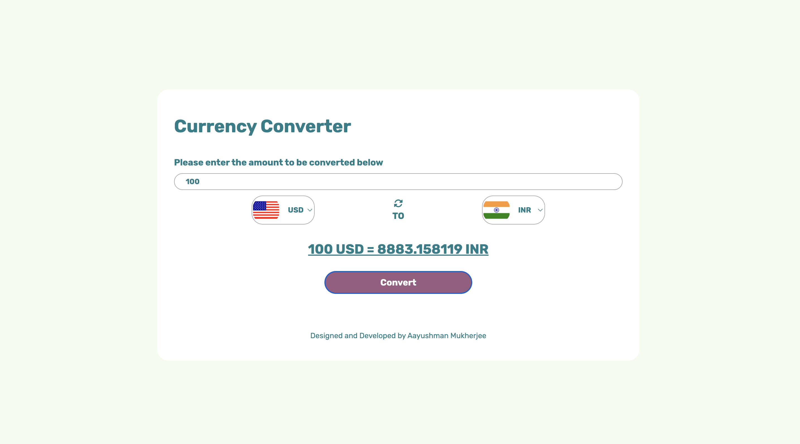

# **Currency Converter**
Currency converter website made using HTML, CSS and Javascript.

The conversion rate is fetched from this API `https://cdn.jsdelivr.net/npm/@fawazahmed0/currency-api@latest/v1/currencies/<country-code>`
The flag of the countries is fetched from this API `https://flagsapi.com/<country-code>/flat/64.png`

# **Preview**

# **Website link**
[Try Cuurency Converter](https://currency-converter-omega-pearl.vercel.app)
